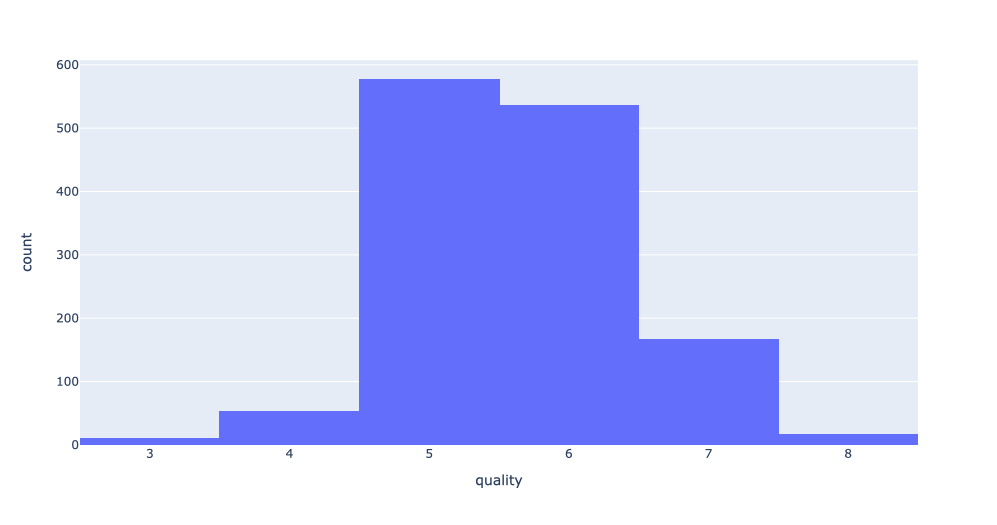
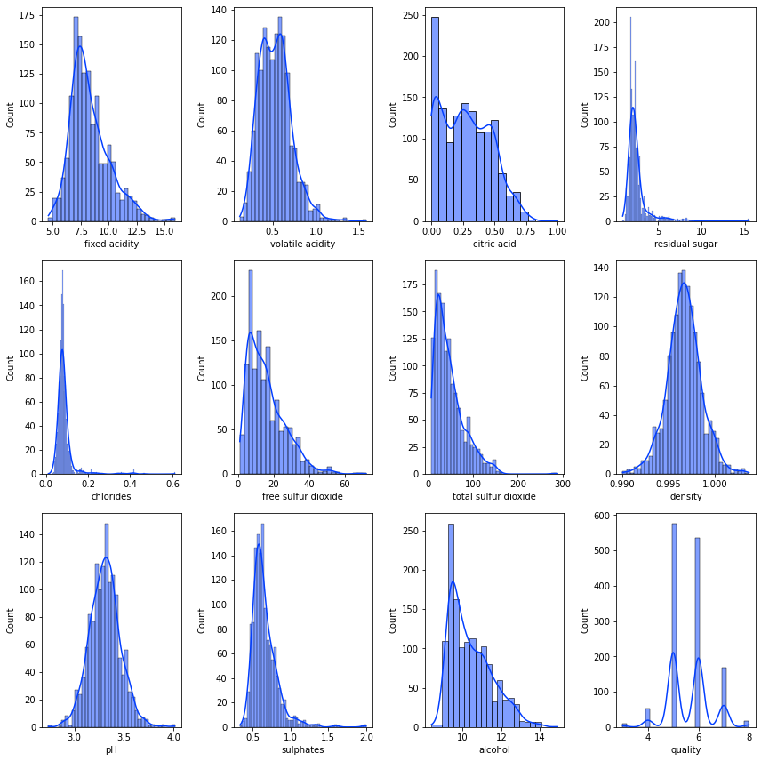
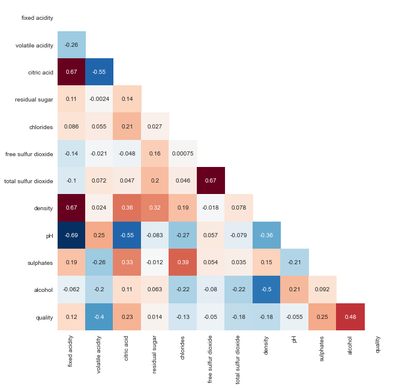
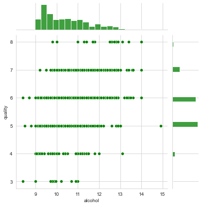
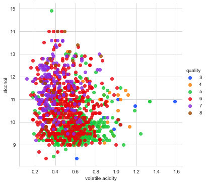
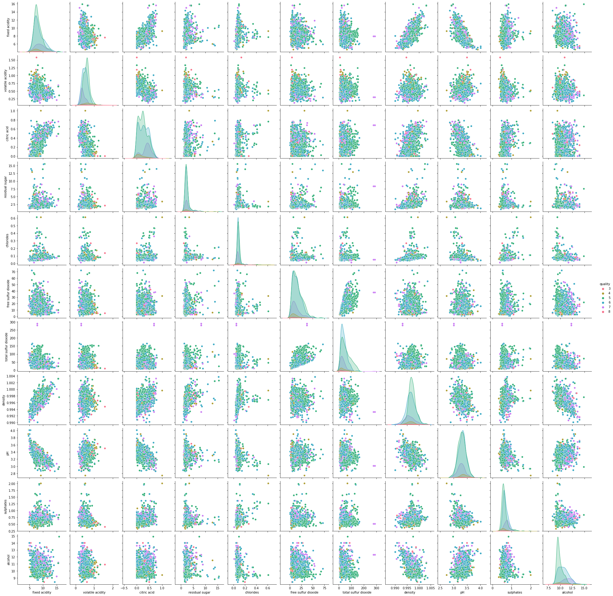

# wine-quality-prediction
Predict wine quality (integer, 1-10) using regression models

```python
Problem name: Wine
URL: https://archive.ics.uci.edu/ml/datasets/Wine+Quality
Dataset: Red
Target variable: quality
Problem type: regression
Data format: semicolon-separated table
Missing values: None
```

#### Input variables (based on physicochemical tests):
변수 의미 출처: https://wikidocs.net/44386

feature|meaning|description
-|-|-
fixed acidity|고정산|와인의 산도를 제어
volatile acidity|휘발산|와인의 향과 연관
citric acid|구연산|와인의 신선함을 올림
residual sugar|잔여 당분|와인의 단 맛 올림
chlorides|염화물|와인의 짠 맛의 원인
free sulfur dioxide|황 화합물|와인을 오래 보관하게 함
total sulfur dioxide|황 화합물|와인을 오래 보관하게 함
density|밀도|와인의 무게감을 나타냄
pH|산성도|와인의 신 맛의 정도
sulphates|황 화합물|와인을 오래 보관하게 함
alcohol|알코올|와인의 단 맛과 무게감에 영향

#### Output variable (based on sensory data): 
- quality (score between 0 and 10), 와인 품질

<br>

## 1. Explanatory Data Analysis

### Sample Size by Label
- 전체적으로 정규분포의 형태를 나타내고 있음
- 특정 target(5,6,7)에 샘플이 집중
    - 교차검증 과정에서 각 Label별 샘플이 골고루 나눠지도록 조치 필요
    - 그러나 target(4, 8, 3)의 경우 샘플 숫자가 너무 적어서 제대로 된 학습이 안될 가능성 높음




### 설명변수 분포 시각화



### Correlation Heatmap


### jointplot
- quality에 대하여 +0.4 이상의 correlation을 나타내는 alcohol 변수

> 결합플롯 시각화 결과, 각 quality value에 대응하는 alcohol 분포에 중첩성이 존재함을 확인

> 산점도(scatter plot)으로부터, 각 quality에 대한 변수의 분포에 outlier 존재함을 확인



### Pairplots (`alcohol` - rest of top 5 features)
- 주요 변수를 2차원 공간에서 시각화했을 때에도 심하게 중첩된 모습을 확인
- 특히, 샘플 숫자가 적은 target(`quality`)에 해당하는 데이터는 크게 sparse한 경향을 보임



### Pairplots (all features)
- 강한 비선형성이 나타남
    - 각 target label에 대응하는 변수 산점도가 서로 뒤엉켜 있는 모습
    - 고차원 공간에서 다변수를 효과적으로 분리하는 방법론을 다양하게 적용해 볼 필요성 존재
        - Random Feature Generation
        - Feature Selection
        - Dimension Reduction
        - Outlier Removal
        - SVM / Neural Network 등 비선형 패턴 파악에 효과적인 Regression Model



<br>

## 2. Preprocess Test
기본 Linear Regression 모델을 사용하여, 다양한 전처리 패키지의 적용 효과를 확인한다.

<br>

### Summary
전처리 프로세스를 적용하여 기본 선형회귀 모델의 테스트셋 MSE 향상
- **(전처리 미적용)0.419 -> (전처리 적용)0.392**

<br>

1. LOF(Local Outlier Factor)
    - 비지도 클러스터링 기반 아웃라이어 탐색
    - 가장 유의미한 효과를 확인하였음

2. PF (Polynomial Features)
    - 기존 11개 설명변수를 조합하여 67개의 새로운 설명변수 생성, 비선형 패턴 파악에 도움될 것으로 기대
    - 피쳐 셀렉션 및 차원축소 기법을 이어서 적용하면 추가적인 성능향상 기대 가능
3. RFE (Recursive Feature Elimination)
    - 주어진 모델로 데이터를 반복 학습하면서, 매 iteration마다 중요성 가장 낮은 설명변수를 제거
4. 차원축소 기법 (PCA, TSNE, LDA)
    - 대표적인 차원축소기법인 PCA만 테스트 진행

> **아웃라이어 제거 -> 변수 생성 -> 피쳐 셀렉션 -> 차원축소** 적용 결과:

> 전처리 미적용 테스트셋 MSE 0.419 -> 0.392 까지 기본 Linear Regression 모델의 성능 향상 확인.


### Conclusion
- 하이퍼파라미터 튜닝을 연산량 적은 모델에 대하여 아래와 같이 진행
    - (예시) Linear Regression (Basic), SVM Regressor (Kernel Trick), ...
- Local Outlier Factor로 아웃라이어 제거한 학습 데이터셋 사용
- `RandomizedSearchCV`를 이용한 파라미터 튜닝
    - `LOF -> PF -> RFE -> PCA` 전처리 파이프라인의 세부 파라미터 튜닝
    - 학습 모델 파라미터 튜닝 (학습방식이 다른 이하 4개 모델)

<br>

## 3. Simple Model Test
목적 : 전처리 및 파라미터 튜닝을 최소화한 상태에서 모델 기본 성능을 검증하고, 튜닝 모델 후보를 선정한다.

<br>

### Test Summary
- Non-boosting 모델 vs. Boosting 계열의 기본 모델 성능 비교
- Test set MSE 지표를 기반으로, Non-boosting, Boosting 각각 2개의 모델을 선정
    - Non-boosting 모델
        - 성능은 boosting에 비하여 떨어지지만 연산효율성이 매우 높음
            - Linear Regression Test MSE -> 0.42
            - SVM Regressor Test MSE -> 0.39
    - Boosting 모델
        - 성능이 우수하지만 연산효율성이 떨어짐
            - RandomForest Regressor Test MSE -> 0.38
            - CatBoost Regressor Test MSE -> 0.38
- 각 모델 특성에 따라 scaler 종류 및 split stratification 여부가 성능에 영향을 미침
    - 각 모델에 적합한 split 방법 적용해야 함
- Simple Neural Net은 머신러닝 모델보다 낮은 성능
    - 데이터 샘플이 딥러닝에 적합한 수준만큼 많지 않기 때문인 것으로 추정


Model(No Tuning)|Best Setting|Best Score(Test MSE)
-|-|-
Linear Regression|(stratified)|0.419
Lasso|(stratified)|0.671
Ridge|(stratified, MinMaxScaler)|0.417
ElasticNet|(stratified)|0.617
SVMRegressor|(non-stratified, RobustScaler)|0.384
RandomForest Regressor|(stratified, StandardScaler)|0.379
GB Regressor|(non-stratified, MinMaxScaler)|0.3846
XGB Regressor|(non-stratified, RobustScaler)|0.4729
LightGBM Regressor|(non-stratified, RobustScaler)|0.4153
CatBoost Regressor|(non-stratified, RobustScaler)|0.379
Keras Simple NN|(stratified, StandardScaler)|0.4707

<br>

### Conclusion
- LinearRegression, SVMRegressor, RandomForestRegressor, CatBoostRegressor 4개 모델 튜닝 진행
- LinearRegression / SVMRegressor:
    - 연산량이 적은 편
    - 모델 자체 하이퍼 파라미터 갯수 적은 편
    - 전처리 파이프라인 적용하여 모델별 최적 전처리 기법도 함께 탐색
        - Polynomial Features, Feature Selection, Dimension Reduction 등
- RandomForestRegressor / CatBoostRegerssor:
    - 연산량이 높은 편
    - 모델 자체 하이퍼 파라미터 갯수가 많은 편
    - 스케일러 테스트만 진행하고, 모델 자체 파라미터 튜닝에 집중

<br>


## 4. Model Tuning

### Linear Regression

#### Result
- Best Cross Validation (StratifiedKFold, n_splits=5) MSE
    - 0.420
- Test MSE
    - 0.471


#### Setting
- Local Outlier Factor
    - `n_neighbors` = 23
    - applied to stratified train set (StandardScaler)  
- Pipeline
```python
{'dimension_reduce': PCA(copy=True, iterated_power='auto', n_components=32, random_state=2021, svd_solver='auto', tol=0.0, whiten=False),
 'feature_selection': RFE(estimator=LinearRegression(copy_X=True, fit_intercept=True, n_jobs=None, normalize=False), n_features_to_select=65, step=1, verbose=0),
 'poly': PolynomialFeatures(degree=2, include_bias=False, interaction_only=True,
                   order='C'), 'poly__degree': 2, 'poly__include_bias': False,
 'regressor': LinearRegression(copy_X=True, fit_intercept=True, n_jobs=None, normalize=False),
 'scale': MinMaxScaler(copy=True, feature_range=(0, 1))}
```


#### Model Performance in Detail
- accuracy (반올림한 예측값과 실제 타깃이 같은 비율)
    - 0.603
- mse_by_target = 각 실제 타깃별로 계산한 MSE

target|accuracy|mse_by_target
-|-|-
3|0.000000|1.737492
4|0.000000|2.368812
5|0.758929|0.317865
6|0.611650|0.286689
7|0.312500|0.770513
8|0.000000|2.146317

<br>

### SVM Regressor

#### Result
- Best Cross Validation (StratifiedKFold, n_splits=5) MSE
    - 0.402
- Test MSE
    - 0.495

#### Setting
- Local Outlier Factor
    - `n_neighbors` = 22
    - applied to NON-stratified train set (StandardScaler)  
- Pipeline

```python
{'scale': StandardScaler(copy=True, with_mean=True, with_std=True), 
 'regressor': SVR(C=100, cache_size=200, coef0=0.0, degree=3, epsilon=0.1, gamma=0.001, kernel='rbf', max_iter=-1, shrinking=True, tol=0.001, verbose=False)}
```

#### Model Performance in Detail
- accuracy (반올림한 예측값과 실제 타깃이 같은 비율)
    - 0.59
- mse_by_target = 각 실제 타깃별로 계산한 MSE


target|accuracy|mse_by_target
-|-|-
3|0.000000|4.496266
4|0.000000|1.753694
5|0.763158|0.193075
6|0.621359|0.269660
7|0.148148|0.934924
8|0.000000|2.211116

<br>

### CatBoost Regressor

#### Result
- Best Cross Validation (StratifiedKFold, n_splits=5) MSE
    - 0.395
- Test MSE
    - 0.423

#### Setting
- Local Outlier Factor
    - `n_neighbors` = 30
    - applied to non-stratified train set (MinMaxScaler)  
- Pipeline

```python
# train set scaler = MinMaxScaler()
OrderedDict([('bagging_temperature', 0.0),
             ('border_count', 112),
             ('depth', 8),
             ('iterations', 918),
             ('l2_leaf_reg', 26),
             ('learning_rate', 0.03284111014718372),
             ('random_strength', 6.959012504143357e-06)])
```


#### Model Performance in Detail
- accuracy (반올림한 예측값과 실제 타깃이 같은 비율)
    - 0.567
- mse_by_target = 각 실제 타깃별로 계산한 MSE

target|accuracy|mse_by_target
-|-|-
3|0.000000|3.901136
4|0.000000|2.166643
5|0.680851|0.237111
6|0.608333|0.252474
7|0.333333|0.725133
8|0.000000|2.394219

<br>

### RandomForest Regressor

#### Result
- Best Cross Validation (StratifiedKFold, n_splits=5) MSE
    - 0.396
- Test MSE
    - 0.484

#### Setting
- Local Outlier Factor
    - `n_neighbors` = 23
    - applied to stratified train set (StandardScaler)  
- Pipeline

```python
# train set scaler = RobustScaler()

OrderedDict([('bootstrap', True),
             ('max_depth', 22),
             ('max_features', 'sqrt'),
             ('min_samples_leaf', 1),
             ('min_samples_split', 2),
             ('n_estimators', 1001)])
```

#### Model Performance in Detail
- accuracy (반올림한 예측값과 실제 타깃이 같은 비율)
    - 0.569
- mse_by_target = 각 실제 타깃별로 계산한 MSE


target|accuracy|mse_by_target
-|-|-
3|0.000000|3.817969
4|0.000000|2.082316
5|0.794643|0.216085
6|0.504854|0.328223
7|0.250000|0.960480
8|0.000000|3.210739


